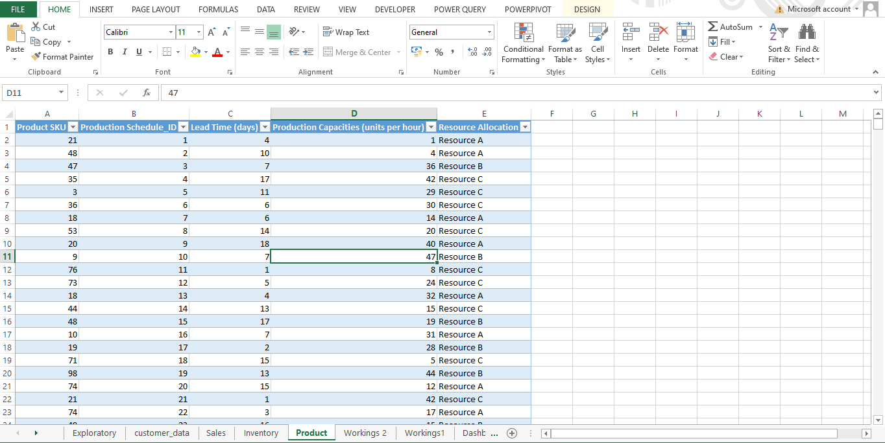
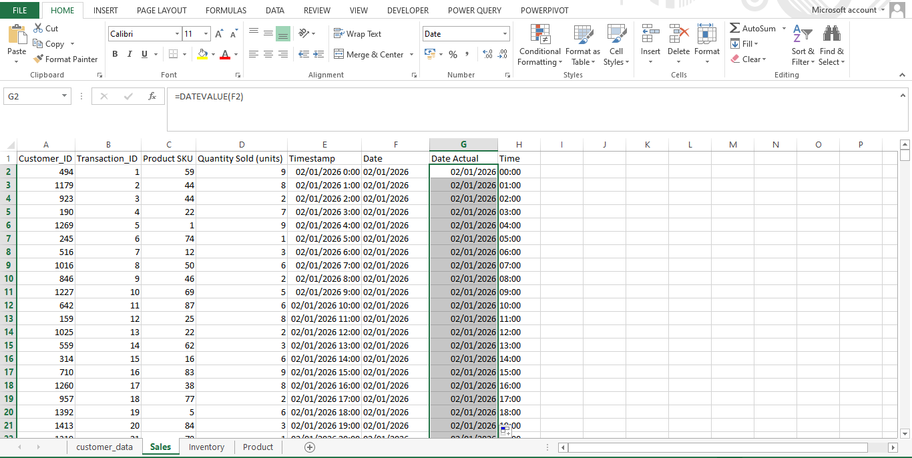
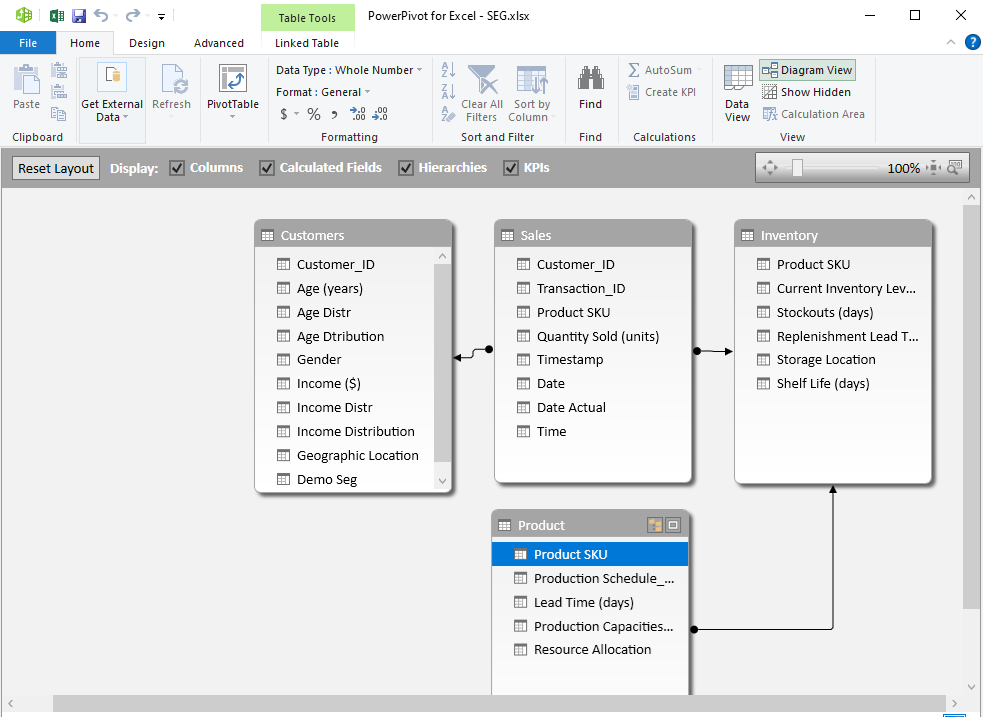
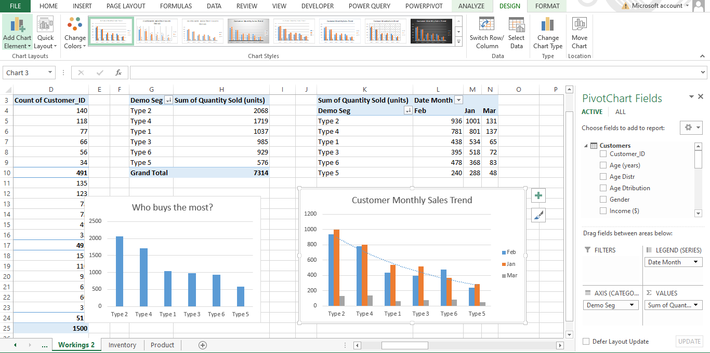
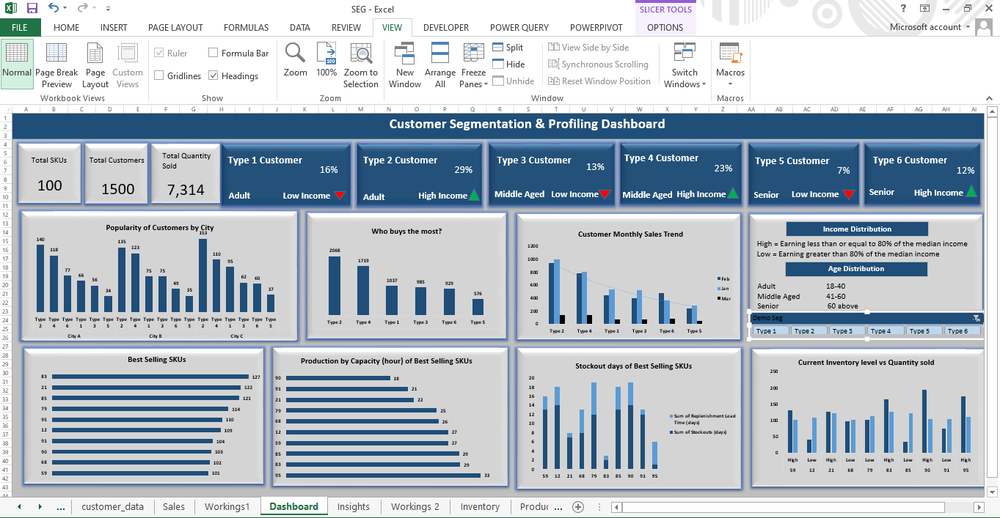

# SmartHome-Solutions-Supply-chain-Analysis
This project looked at customer segmentation and profiling, that is, data-driven supply chain planning by leveraging customer data to plan production for the next year 

## Introduction
SmartHome Solutions Inc. faces a significant challenge in optimizing its supply chain and production planning so, by leveraging customer data, SmartHome Solutions Inc. can streamline production processes, reduce operational costs and optimize resource allocation leading to a more efficient supply chain. 

## Problem Statement
The following are the challenges the business face
* Relying on historical data results in overproduction or underproduction causing operational inefficiencies and increased costs.
* The company lacks a deep understanding of its diverse customer base, making it challenging to align production with specific customer demands.
* Inefficient production planning has led to excess inventory, tying up valuable resources and impacting the company's profitability.

## Data Source
The data used for this work is gotten from [Amdari](https://www.amdari.io)

## Skills and Concepts demonstrated
The following are some of the Excel skills and concept demonstrated during the project:
* Data Validation
* Dynamic Named Ranges
* Dashboard Design and Layout
* Using advanced functions such as index-match, countifs and so on
* Designing a User Experience (UX) interface
* Interactive Elements
* Branding and Color Coordination

## Data Transformation
There are 4 tables namely, customer, sales, production and inventory data. 
* Data Preview

### Data Cleaning
Checked for missing values, duplicates and consistencies in all 4 datasets to ensure the dataset is fit for exploration and also transformed the dataset by changing the columns to the right data types 
* Data Cleaning

### Data Modelling
The tables were connected using primary and foreign keys
* Model View

### Data Analysis
* Created pivot tables and customized the charts 
* Performed lots of calculations in the dataset, aggregated and presented data in a concise format.
* Extracted specific information from datasets

Exploratory Data Analysis

### Data visualization
* Selected and incorporated appropriate cliparts
* Chose colors that harmonize with the overall dashboard theme and maintained a consistent theme throughout the dashboard
* Created a user-friendly interface for interactivity
* Designing an organized and visually appealing layout.
* Set up slicer to show details of each selection on customer type

Dashboard

## Insights
* The even distribution across different age groups and the presence of various gender groups indicate a wide-ranging customer base
* The majority of customers being adults with higher income levels suggests prioritizing SKUs for this customer segment
* Different preferences in various cities highlight the need for region-specific strategies
* Each customer segment (Type 1 to Type 6) shows distinct preferences for certain SKUs, emphasizing the importance of tailored product offerings
* The identification of top SKUs purchased by customers indicates a focused demand for specific products
* Sales vary across different months, locations and customer types, highlighting the need to consider seasonal trends and regional differences in sales strategies.

## Recommendations 
* Focus production on top SKUs for each customer segment, ensuring they are well-stocked and readily available. For lower-value SKUs, adopt a lean production approach to minimize excess inventory
* Tailor inventory and product offerings to regional preferences, ensuring that popular products are available in the right locations
* Develop targeted marketing campaigns for each customer segment (Type 1 to Type 6) focusing on their preferred SKUs and align marketing campaigns with peak sales periods to capitalize on increased demand
* Adjust production schedules and inventory levels based on sales trends of top SKUs which reflect the specific demands of each customer segment
* Optimize distribution and logistics to cater to the unique demands of each geographical location
* Regularly analyze sales data to adopt strategies in real time
* Use customer feedback to refine product offerings and marketing strategies
* Engage with different customer groups to build brand loyalty and gain deeper insights into their preferences. Provide excellent customer service to enhance satisfaction and loyalty.

## Summary
* The segmentation of customers are in six distinct types based on age and income providing a nuanced understanding of the customer base
* Key performance indicators such as total SKUs, total customers and total quantity sold are tracked to provide a clear view of the overall performance and areas for improvement
* The insights gained from the analysis such as product preferences, high-value SKUs and sales variability have been instrumental in shaping the product strategy, inventory management and marketing efforts
* The recommendations provided including dynamic stocking, regional inventory tailoring and segment-specific marketing campaigns are practical and actionable
* The emphasis on regularly analyzing sales data and using customer feedback to refine strategies ensures that we can adapt to changes in real time and stay responsive to market demands
* Engaging with different customer groups to build brand loyalty and gain deeper insights into their preferences will help maintain a strong connection with customers and better meet their needs.

## Thank you for reading.

